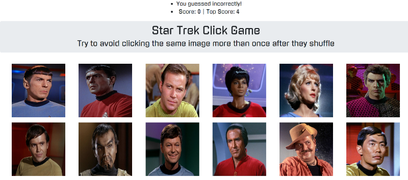

# react-click-game
A memory game created using React.js

https://taddes.github.io/react-click-game/

This app uses React.js state and props to modify the DOM via three distinct components, including: `Header`, `Navbar` and `Item`. 

Various images of Star Trek characters are generated and randomized based on the user's clicks.  When a user clicks a character, they recieve a point and the images shuffle around.  The user then tries to click an image without repeating the image they clicked.  If they do click a previously selected character, the game restarts.  A total score tally keeps track of the highest score achieved. 

